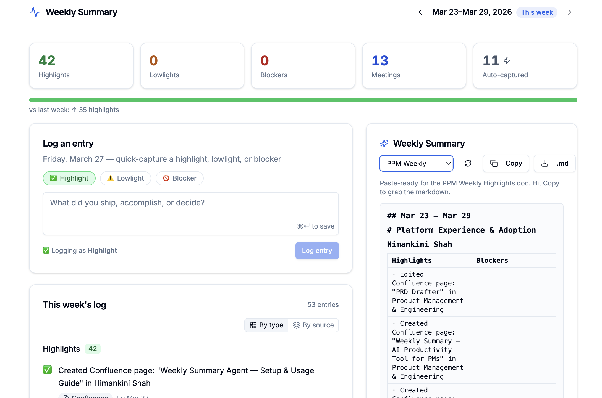
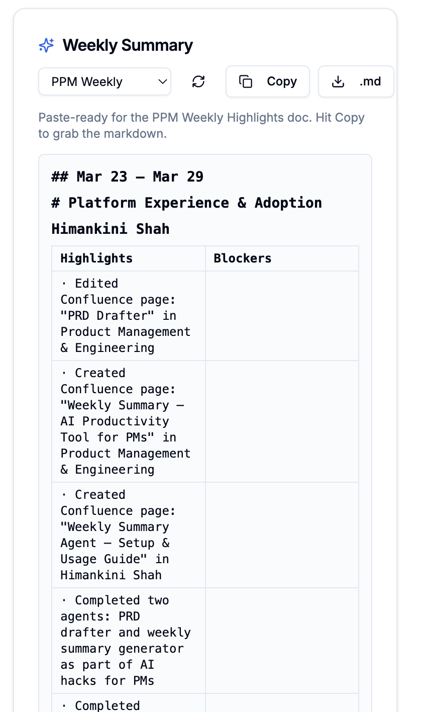
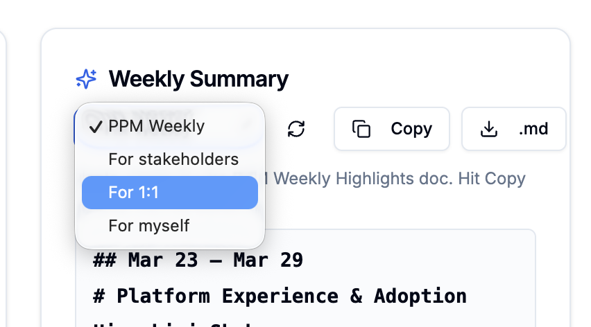
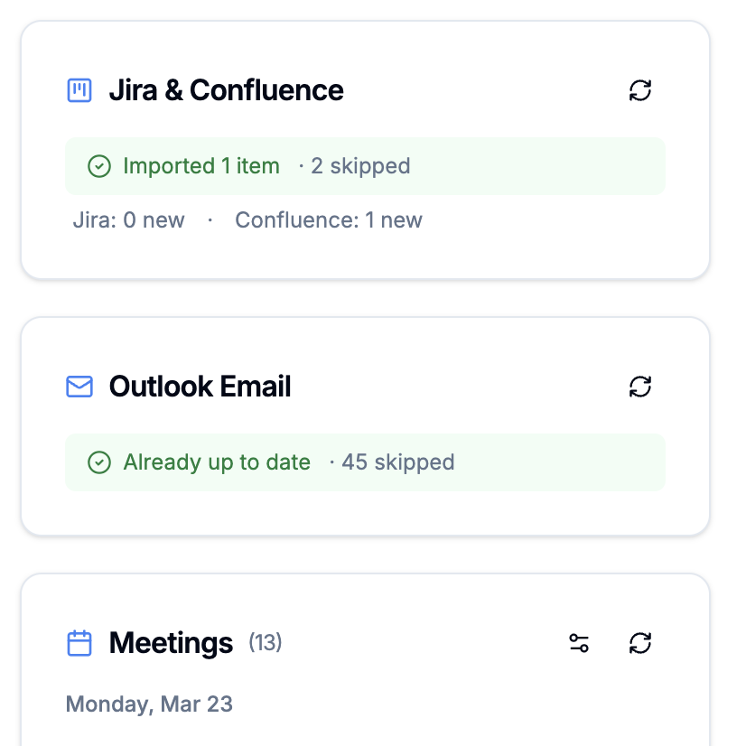

# Weekly Summary

A local-first weekly work summarizer for PMs. Auto-pulls from Jira, Outlook, calendar, and Claude Code to generate structured weekly summaries in multiple formats — PPM Weekly Highlights table, stakeholder narrative, 1:1 prep, and personal reference. Saves 30–60 min/week on status reporting.

Built as part of the **AI Hacks for PMs** initiative.



## What it does

- **Manual entries** — log highlights, lowlights, and blockers directly from the dashboard
- **Jira via API** — syncs resolved, in-progress, and blocked tickets from fico-prod.atlassian.net
- **Confluence via API** — syncs pages you created or edited this week
- **Outlook emails via Power Automate** — imports sent emails, classifies them as highlights or blockers
- **Calendar via ICS** — pulls meetings from your Outlook ICS feed
- **Claude Code auto-capture** — captures prompts via a hook on every Claude Code session

All data stays on your machine at `~/.weekly-pulse/weekly-pulse.db` — nothing is sent to any external server.

## Summary formats

Click **Generate Summary** and choose your audience from the dropdown:

| Format | Best for |
|---|---|
| **PPM Weekly Highlights** (default) | Paste-ready markdown table for the team doc |
| **For Stakeholders** | Narrative with bold topics, Jira/email rollups, and source list |
| **For 1:1 with Manager** | Stakeholder view + key decisions + next week preview |
| **For Myself** | Full detail — all sections including meetings and Jira enrichment |





## Setup

**Prerequisites:** Node.js 20+, Claude Code installed

```bash
git clone https://github.com/himankinis/weekly-pulse
cd weekly-pulse
npm install
```

### 1. Configure credentials

Create a `.env` file in the project root:

```
JIRA_URL=https://fico-prod.atlassian.net
JIRA_EMAIL=your_email@fico.com
JIRA_API_TOKEN=your_token

CONFLUENCE_URL=https://fico-prod.atlassian.net
CONFLUENCE_EMAIL=your_email@fico.com
CONFLUENCE_API_TOKEN=your_token
```

Generate your API token at: https://id.atlassian.com/manage-profile/security/api-tokens

### 2. Register Claude Code hooks

```bash
npm run setup
```

Start a new Claude Code session after running setup for the hook to take effect. The dev server must be running for auto-capture to work.

### 3. Start the dashboard

```bash
npm run dev
```

Open **http://localhost:3000**.

### 4. Connect your calendar

Click **"Add ICS Feed"** on the dashboard and paste your Outlook calendar ICS URL.

> Outlook Web → Settings → Calendar → Shared calendars → Publish a calendar → copy the ICS link.

### 5. Set up Outlook email export (optional)

Create a Power Automate flow that exports your sent emails to a JSON file in your OneDrive. The agent reads this file weekly to classify emails as highlights or blockers.

### 6. Sync Jira & Confluence

Click **"Sync Jira & Confluence"** in the dashboard to pull this week's tickets and pages.



## Usage

| Script | Description |
|---|---|
| `npm run dev` | Start dashboard at http://localhost:3000 |
| `npm run setup` | Register Claude Code hooks |
| `npm run report` | Print weekly summary in terminal |

## Entry types

| Type | Meaning |
|---|---|
| ✅ Highlight | Accomplishment, shipped work, good decision |
| ⚠️ Lowlight | Delay, missed target, thing that took longer |
| 🚫 Blocker | Dependency, access issue, waiting on others |

## Tech stack

- **Framework:** Next.js 15 with App Router
- **Database:** SQLite via `better-sqlite3`
- **UI:** shadcn/ui + Tailwind CSS
- **Language:** TypeScript
- **Integrations:** Jira REST API, Confluence REST API, Outlook via Power Automate, ICS calendar feeds
